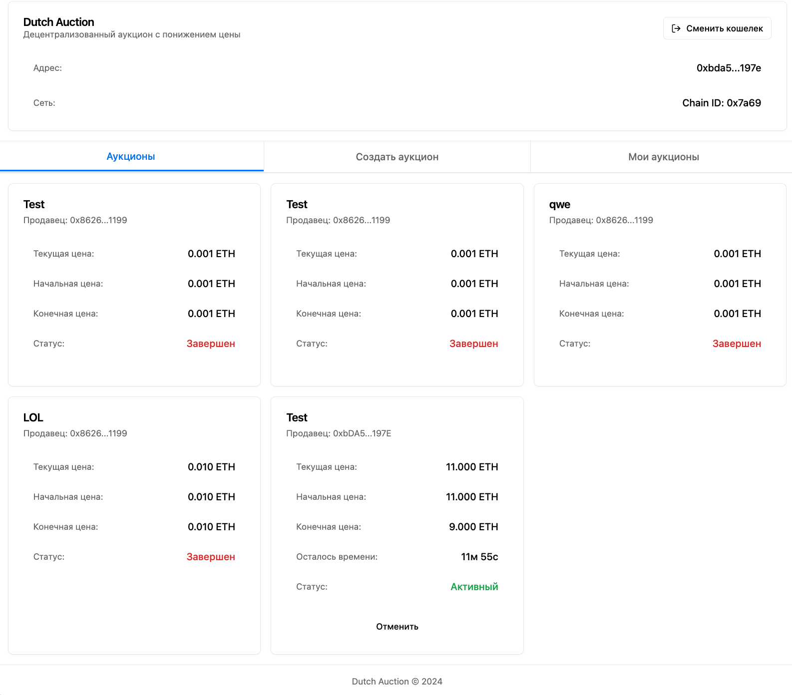

# Dutch Auction DApp

A simple decentralized application (DApp) implementing a Dutch auction mechanism. This is an educational project designed to demonstrate the basic concepts of blockchain development, smart contracts, and web3 integration.

## Overview

A Dutch auction is a price discovery mechanism where the price starts high and gradually decreases over time until a buyer makes a purchase. This implementation includes basic features with several simplifications for educational purposes.




## Simplifications & Limitations

- No real item/token ownership tracking
- Simple price reduction mechanism
- Basic error handling
- Limited auction parameters validation
- No complex auction management features
- No bidding history
- No advanced security measures

## Technical Stack

### Smart Contract
- Solidity ^0.8.0
- OpenZeppelin contracts for:
    - Access Control (Ownable)
    - Security (ReentrancyGuard)
- Development Environment:
    - Hardhat
    - Ethereum

### Frontend
- React
- ethers.js
- TailwindCSS
- shadcn/ui components

## Features

- Create Dutch auctions with:
    - Custom starting price
    - Custom ending price
    - Custom duration
- View all active auctions
- View personal auctions
- Real-time price updates
- MetaMask wallet integration
- Responsive design

## Getting Started

### Prerequisites
- Node.js
- MetaMask browser extension
- Hardhat for local development

### Installation

1. Clone the repository:
```bash
git clone https://github.com/yourusername/dutch-auction-dapp.git
```

2. Install contract dependencies:
```bash
npm install
```

3. Install frontend dependencies:
```bash
cd dutch-auction-frontend
npm install
```

### Running Locally

1. Start local Hardhat node:
```bash
npx hardhat node
```

2. Deploy the contract:
```bash
npx hardhat ignition deploy ./ignition/modules/Auction.sol.ts
```

3. Start the frontend:
```bash
cd dutch-auction-frontend
npm run dev
```

4. Configure MetaMask:
- Network: Hardhat Local
    - RPC URL: http://127.0.0.1:8545
    - Chain ID: 31337
    - Currency Symbol: ETH

## Smart Contract

The main contract (`DutchAuctionWithFee.sol`) implements:
- Auction creation and management
- Price reduction over time
- Platform fee mechanism
- Basic access control
- Reentrancy protection

## Development Notes

This project is intended for educational purposes and demonstrates:
- Smart contract development
- Web3 integration
- React component architecture
- Responsive UI design
- Wallet integration
- Basic error handling

## Future Improvements

Potential areas for enhancement:
- NFT integration for item ownership
- Advanced auction parameters
- Bidding history
- Advanced security measures
- Extended unit tests
- More complex price reduction mechanisms
- Better error handling and user feedback
- Transaction status tracking
- Event listening and real-time updates

## Security Notice

This is an educational project and should not be used in production without significant security improvements and thorough auditing.

## Contributing

This is an educational project, but contributions are welcome. Please feel free to submit issues and pull requests.

## License

MIT License - see the [LICENSE](LICENSE) file for details.

---

### Note

This project is for educational purposes only and includes several simplifications. For a production environment, additional features, security measures, and testing would be required.


# Useful commands

```shell
npx hardhat help
npx hardhat test
REPORT_GAS=true npx hardhat test
npx hardhat ignition deploy ./ignition/modules/Auction.sol.ts

# start the local node
npx hardhat node

# deploy the contract
npx hardhat ignition deploy ignition/modules/DutchAuctionModule.ts --network localhost

# start the console to interact with the contract
npx hardhat console --network localhost


```